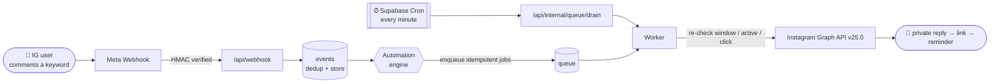

<div align="center">

# 🤖 Manyjean

### Your own private Instagram automation engine — a focused, self-hosted ManyChat alternative.

_Reply to keyword comments, story replies and DMs. Respect Instagram's 24h window. Send trackable links and reminders — all from accounts **you own**._

<br/>


</div>

---

## 📖 About

**Manyjean** is a single-admin, single-tenant application that automates conversations
**legitimately initiated** by Instagram users on your own Business/Creator accounts. When
someone comments a keyword, replies to a story, or sends a DM, Manyjean answers, opens the
messaging window, and can follow up with a trackable link and a reminder — always within
Meta's current rules.

Built to run at **≈ $0/month** at low personal volume on **Vercel Hobby + Supabase Free**.

> [!NOTE]
> This is a **private tool** for the owner's own Instagram accounts. It does **not** send
> cold/bulk messages, import cold audiences, or try to bypass the messaging window.

## ✨ Features

- 💬 **Comment → private reply** — one reply per comment, inviting an inbound action (ManyChat's signature flow)
- 📥 **Story reply & DM automations** — keyword matching with `contains` / `exact` / `any` (accent-aware)
- ⏱️ **Messaging window aware** — the 24h window opens **only** on a real inbound event, re-checked at send time
- 🔗 **Trackable links** — `/r/<code>` records clicks and cancels the reminder on click
- 🔁 **Durable queue** — atomic claim (`FOR UPDATE SKIP LOCKED`), dedupe, retry with backoff + jitter, stuck-job recovery
- 🏢 **Multiple owned accounts** — connect and automate several of your own accounts independently
- 🔐 **Encrypted tokens** — access tokens stored with AES-256-GCM; secrets never touch the DB or logs
- 📊 **Admin dashboard** — connection status, automation builder, post picker, event/queue history, diagnostics

## 🏗️ How It Works



1. A keyword event arrives → **signature-verified**, deduplicated, and stored.
2. The engine matches active automations and enqueues idempotent jobs.
3. **Supabase Cron** drains the queue every minute (Vercel Hobby cron only runs once/day).
4. The worker re-checks live state (window open? automation active? already clicked?) and sends.

## 🛠️ Tech Stack

| Layer | Technologies |
|---|---|
| **Framework** | Next.js 16 (App Router, `proxy.ts`, Server Actions) |
| **Language** | TypeScript (strict) |
| **UI** | Tailwind CSS v4 |
| **Database** | Supabase Postgres · RLS · `pg_cron` + `pg_net` · Vault |
| **Auth** | Supabase Auth (email + password / magic link) |
| **Validation** | Zod |
| **Testing** | Vitest (60 unit tests) |
| **Hosting** | Vercel (Node.js runtime) |
| **Platform** | Instagram API with Instagram Login (Graph **v25.0**) |

## 🚀 Getting Started

```bash
# 1. Clone & install
git clone https://github.com/Jeanfr1/Mymany.git && cd Mymany
npm install

# 2. Configure (see the table below)
cp .env.example .env.local

# 3. Run
npm run dev            # http://localhost:3000

# 4. Verify everything (lint + typecheck + tests + build)
npm run verify
```

## 🔑 Environment Variables

| Variable | Public? | Description |
|---|:---:|---|
| `NEXT_PUBLIC_APP_URL` | ✅ | Base URL of the app |
| `NEXT_PUBLIC_SUPABASE_URL` | ✅ | Supabase project URL |
| `NEXT_PUBLIC_SUPABASE_ANON_KEY` | ✅ | Supabase publishable key |
| `SUPABASE_SERVICE_ROLE_KEY` | 🔒 | Server-only DB access (bypasses RLS) |
| `INSTAGRAM_APP_ID` | 🔒 | Instagram app ID (OAuth) |
| `INSTAGRAM_APP_SECRET` | 🔒 | Instagram app secret (OAuth) |
| `META_APP_SECRET` | 🔒 | Optional — webhook may be signed with this |
| `INSTAGRAM_VERIFY_TOKEN` | 🔒 | Webhook GET handshake token |
| `TOKEN_ENCRYPTION_KEY` | 🔒 | AES-256-GCM key (base64, 32 bytes) |
| `INTERNAL_CRON_SECRET` | 🔒 | Guards `/api/internal/*` endpoints |
| `ADMIN_EMAILS` | 🔒 | Comma-separated admin allowlist |

> [!WARNING]
> `🔒` values are **secrets** — set them in the Vercel dashboard, never commit them.
> Generate them with `openssl rand -base64 32` / `openssl rand -hex 32`.

<details>
<summary><b>🗄️ Database schema</b> (click to expand)</summary>

Versioned SQL migrations live in [`supabase/migrations/`](supabase/migrations). Nine tables,
**RLS enabled deny-all** on every one (access only via the service role):

`instagram_accounts` · `automations` · `followups` · `contacts` · `events` · `queue` ·
`tracking_links` · `click_events` · `oauth_states`

Highlights: atomic `claim_queue_jobs()` RPC (`FOR UPDATE SKIP LOCKED` + stuck-job recovery),
unique dedup constraints, and hot-path indexes for the queue and webhook flow.

</details>

<details>
<summary><b>📁 Project structure</b> (click to expand)</summary>

```
src/
├── app/
│   ├── api/
│   │   ├── webhook/            # HMAC-verified Meta webhook
│   │   ├── oauth/             # Instagram connect flow
│   │   └── internal/          # Cron-driven queue drain + token refresh
│   ├── dashboard/             # Auth-gated admin UI
│   └── r/[code]/             # Trackable redirect
├── lib/
│   ├── instagram/            # Graph API client, OAuth, errors
│   ├── webhook/              # Signature, tolerant parsers, dedup
│   ├── engine/               # Automation matching + job creation
│   ├── worker/               # Queue drain, backoff, send handlers
│   ├── crypto/               # AES-256-GCM token encryption
│   └── repos/                # Typed data-access layer
supabase/migrations/          # Versioned SQL
docs/                         # DECISIONS, SECURITY, RUNBOOK, DEPLOYMENT
```

</details>

## 🧪 Testing

```bash
npm test          # 60 unit tests (Vitest)
npm run verify    # lint + typecheck + test + production build
```

Covers keyword normalization & matching, webhook signature (valid/tampered/dual-secret),
tolerant payload parsing, dedup hashing, messaging-window logic, retry/backoff, URL safety,
OAuth URL building, and token crypto (round-trip + tamper rejection). Queue atomicity,
stuck-job recovery and OAuth single-use are verified live against the database
(see [`docs/VERIFICATION.md`](docs/VERIFICATION.md)).

## 🔒 Security

- 🔑 Access tokens **AES-256-GCM encrypted**; key lives only in env vars, never in the DB or logs
- ✍️ Webhook payloads verified with **constant-time HMAC-SHA256** over the raw body
- 🛡️ **RLS deny-all** on every table; all access via a server-only service role
- 🚦 Internal endpoints gated by a constant-time secret compare
- 🔗 Redirects allowed only to **pre-registered `https://`** URLs; click IPs stored **hashed**

## 📚 Documentation

| Doc | What's inside |
|---|---|
| [`docs/DECISIONS.md`](docs/DECISIONS.md) | Platform audit & architecture decisions |
| [`docs/SECURITY.md`](docs/SECURITY.md) | Security checklist |
| [`docs/RUNBOOK.md`](docs/RUNBOOK.md) | Operations & recovery |
| [`docs/DEPLOYMENT.md`](docs/DEPLOYMENT.md) | Deploy checklist |
| [`docs/VERIFICATION.md`](docs/VERIFICATION.md) | Test coverage & live checks |

## 📜 License

Private project — all rights reserved. © Jean Pereira.

## 🙏 Acknowledgments

Built with [Next.js](https://nextjs.org), [Supabase](https://supabase.com),
[Vercel](https://vercel.com), and the [Instagram Platform](https://developers.facebook.com/docs/instagram-platform).

---

<div align="center">

⭐ **Star this repo if you find it useful!**

Built with ❤️ by [Jean Pereira](https://github.com/Jeanfr1)

</div>
